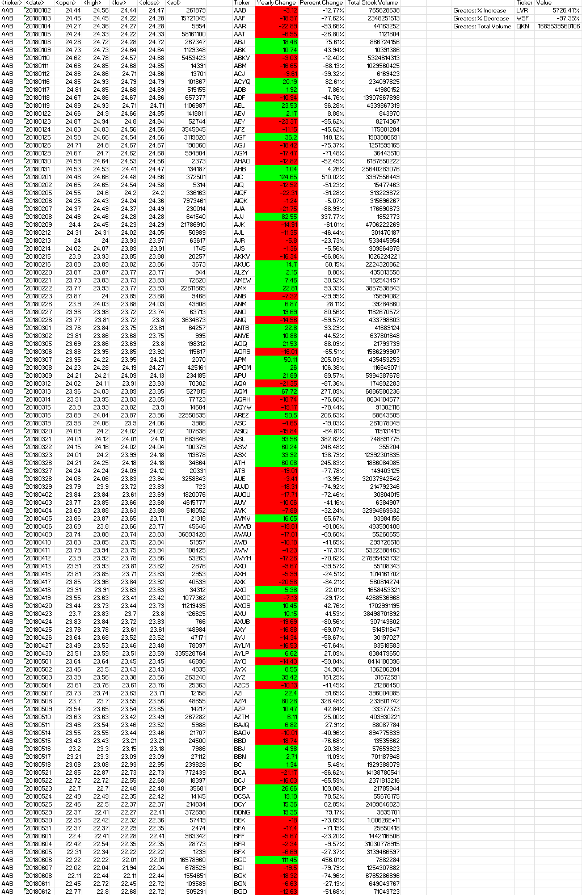
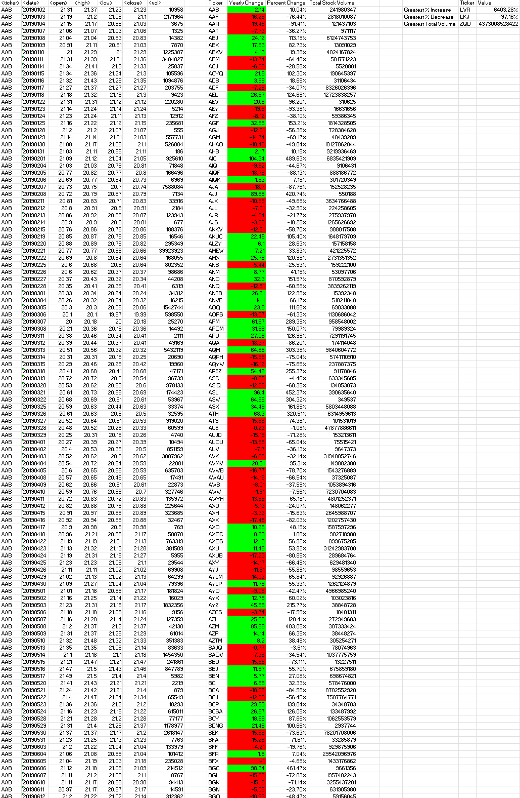
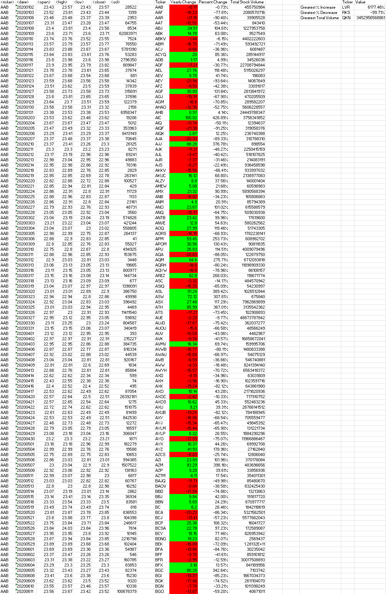

# Stock-Analysis-in-Visual-Basic-for-Applications

> Use VBA to analyze generated stock market data. Output the changes that occurred in a year and the greatest increases, decreases, and total volume along with their associated tickers.

## Background - Requirements

> This project uses VBA script to analyze stock market data. In developing the script, the [Test Data](./VBA_Script_Test_Sample/alphabetical_testing.xlsm) was used for its smaller sample size.
once the script was developed, it was applied to the [Stock Data](./VBA_Stock_Data/Multiple_year_stock_data.xlsm) set. The script is meant to loop through all the data and output two sets of information.

| Data Set | Description |
|--------------|---------------|
| Summary of the Individual Stock | The script outputs a line for each stock. In this line, it will summarize the stock with its Ticker, Yearly Change (+/-), Percent Change(+/-), and Total Stock Volume |
| Summary of the Greatest Changes & Values | The script outputs a line for 3 stocks; the greatest % increase, the greatest % decrease, and greatest total volume along with the ticker for each stock referenced respectively |

## Notable Items
> - When I was making the loops, I was considering making 2 'For' loops; one for the summarization of each stock and one for the greatest summary. Instead, while the main 'For' loop was running, I had an 'If' statement running passively to collect the variables needed for the greatest summary. This turned out to make the script more simple and efficient.
> - When creating the script for conditional formatting, my initial approach was to take the range of the values in the column and format it separately from the 'For' statement. This turned out to be difficult and I could not find a way of easily manipulating the 'Range() Object' without getting some kind of error or even successfully running the code without any output. My second approach was to apply conditional formating in the 'For' loop right after the 'Cell' had its value applied.

## Outcomes - (2018-2020)
### 2018

### 2019

### 2020

## Rubric

[Unit 2 Rubric - VBA Homework - The VBA of Wall Street](https://docs.google.com/document/d/1OjDM3nyioVQ6nJkqeYlUK7SxQ3WZQvvV3T9MHCbnoWk/edit?usp=sharing)

## References

* Dataset generated by Trilogy Education Services, LLC.

- - -

© 2022 Trilogy Education Services, a 2U, Inc. brand. All Rights Reserved.